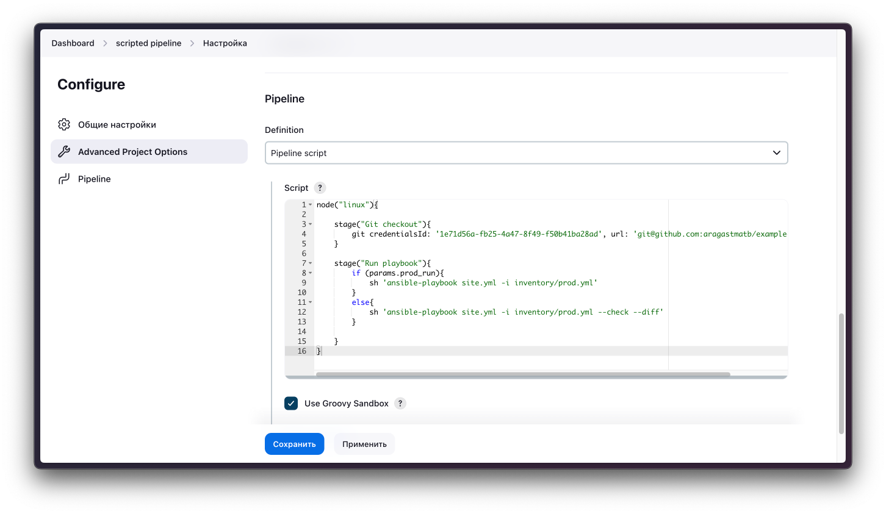

# Домашняя работа к занятию 10 «Jenkins»

## Подготовка к выполнению

1. Создать два VM: для jenkins-master и jenkins-agent.
2. Установить Jenkins при помощи playbook.
3. Запустить и проверить работоспособность.
4. Сделать первоначальную настройку.

## Основная часть

1. Сделать Freestyle Job, который будет запускать `molecule test` из любого вашего репозитория с ролью.

> Сборочная директория с исходниками роли и успешная сборка #9

2. Сделать Declarative Pipeline Job, который будет запускать `molecule test` из любого вашего репозитория с ролью.

> Скрипт

> Успешное выполнение pipeline

3. Перенести Declarative Pipeline в репозиторий в файл `Jenkinsfile`.

> Перенес удалив секцию про гит - [Jenkinsfile](https://github.com/zemlyachev/vector-role/blob/main/Jenkinsfile)

4. Создать Multibranch Pipeline на запуск `Jenkinsfile` из репозитория.

5. Создать Scripted Pipeline, наполнить его скриптом из [pipeline](./pipeline).
6. Внести необходимые изменения, чтобы Pipeline запускал `ansible-playbook` без флагов `--check --diff`, если не установлен параметр при запуске джобы (prod_run = True). По умолчанию параметр имеет значение False и запускает прогон с флагами `--check --diff`.

> Добавляем параметры для запуска

> Правим скрипт

> Получаем чекбокс при запуске с параметрами

7. Проверить работоспособность, исправить ошибки, исправленный Pipeline вложить в репозиторий в файл `ScriptedJenkinsfile`.

> [Scripted Pipeline](./pipeline/ScriptedJenkinsfile)

8. Отправить ссылку на репозиторий с ролью и Declarative Pipeline и Scripted Pipeline.

> [Declarative Pipeline Jenkinsfile](https://github.com/zemlyachev/vector-role/blob/main/Jenkinsfile)
> 
> [Scripted Pipeline](./pipeline/ScriptedJenkinsfile)