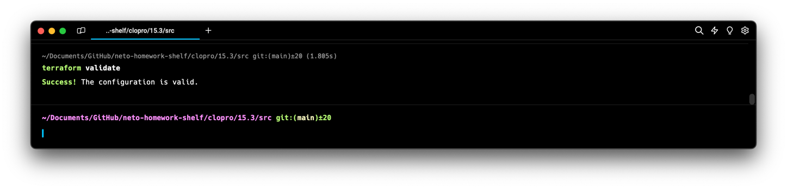
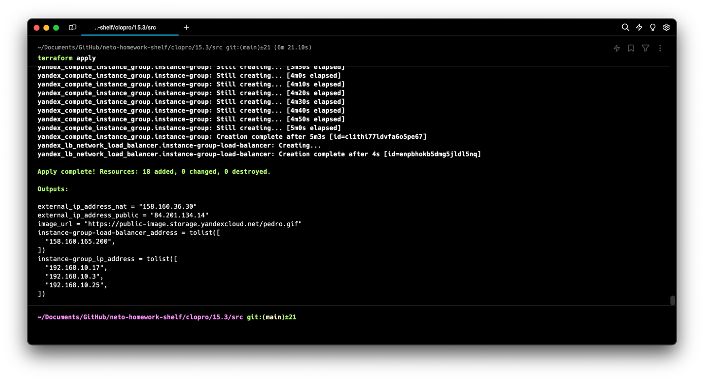
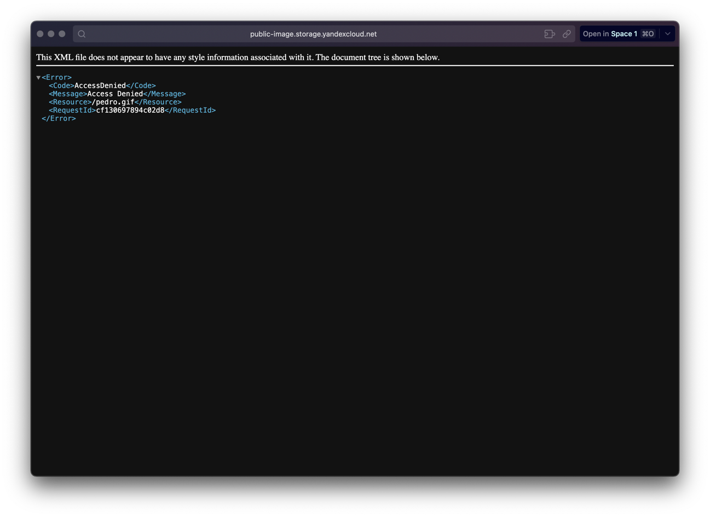
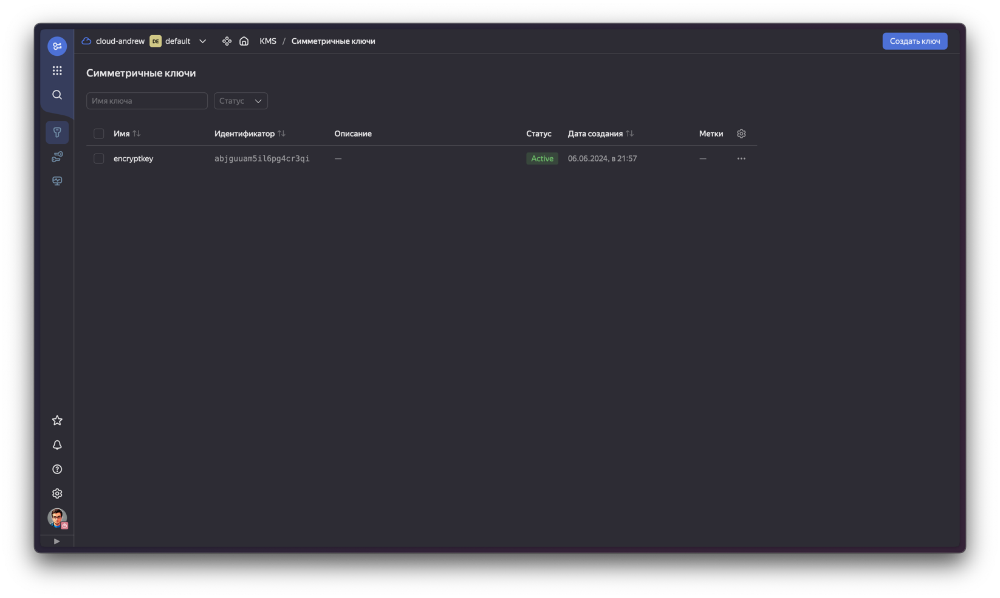

# Домашняя работа к занятию «Безопасность в облачных провайдерах»

Используя конфигурации, выполненные в рамках предыдущих домашних заданий, нужно добавить возможность шифрования бакета.

---
## Задание 1. Yandex Cloud

1. С помощью ключа в KMS необходимо зашифровать содержимое бакета:

- создать ключ в KMS;
- с помощью ключа зашифровать содержимое бакета, созданного ранее.

> Берем проект из предыдущего задания и добавляем манифест [security.tf](src/security.tf)
> 
> В `yandex_storage_bucket.public-image` [bucket.tf](src/bucket.tf) добавим
> ```yaml
>   ...
>   server_side_encryption_configuration {
>     rule {
>       apply_server_side_encryption_by_default {
>         kms_master_key_id = yandex_kms_symmetric_key.encryptkey.id
>         sse_algorithm     = "aws:kms"
>       }
>     }
>   }
>   ...
> ```
> Проверим валидность

> Посмотрим план и применяем

> Проверим что по прямой ссылки картинка недоступна

> Ключ в консоли

> Уничтожим все


2. (Выполняется не в Terraform)* Создать статический сайт в Object Storage c собственным публичным адресом и сделать доступным по HTTPS:

- создать сертификат;
- создать статическую страницу в Object Storage и применить сертификат HTTPS;
- в качестве результата предоставить скриншот на страницу с сертификатом в заголовке (замочек).

Полезные документы:

- [Настройка HTTPS статичного сайта](https://cloud.yandex.ru/docs/storage/operations/hosting/certificate).
- [Object Storage bucket](https://registry.terraform.io/providers/yandex-cloud/yandex/latest/docs/resources/storage_bucket).
- [KMS key](https://registry.terraform.io/providers/yandex-cloud/yandex/latest/docs/resources/kms_symmetric_key).

--- 

Пример bootstrap-скрипта:

```
#!/bin/bash
yum install httpd -y
service httpd start
chkconfig httpd on
cd /var/www/html
echo "<html><h1>My cool web-server</h1></html>" > index.html
aws s3 mb s3://mysuperbacketname2021
aws s3 cp index.html s3://mysuperbacketname2021
```

### Правила приёма работы

Домашняя работа оформляется в своём Git репозитории в файле README.md. Выполненное домашнее задание пришлите ссылкой на .md-файл в вашем репозитории.
Файл README.md должен содержать скриншоты вывода необходимых команд, а также скриншоты результатов.
Репозиторий должен содержать тексты манифестов или ссылки на них в файле README.md.
