# Домашняя работа к занятию «Хранение в K8s. Часть 2»

### Цель задания

В тестовой среде Kubernetes нужно создать PV и продемострировать запись и хранение файлов.

------

### Чеклист готовности к домашнему заданию

1. Установленное K8s-решение (например, MicroK8S).
2. Установленный локальный kubectl.
3. Редактор YAML-файлов с подключенным GitHub-репозиторием.

------

### Дополнительные материалы для выполнения задания

1. [Инструкция по установке NFS в MicroK8S](https://microk8s.io/docs/nfs).
2. [Описание Persistent Volumes](https://kubernetes.io/docs/concepts/storage/persistent-volumes/).
3. [Описание динамического провижининга](https://kubernetes.io/docs/concepts/storage/dynamic-provisioning/).
4. [Описание Multitool](https://github.com/wbitt/Network-MultiTool).

------

### Задание 1

**Что нужно сделать**

Создать Deployment приложения, использующего локальный PV, созданный вручную.

1. Создать Deployment приложения, состоящего из контейнеров busybox и multitool.
2. Создать PV и PVC для подключения папки на локальной ноде, которая будет использована в поде.
> [Файл с Deployment, PV и PVC](src/01-dpl-footcloth.yaml)
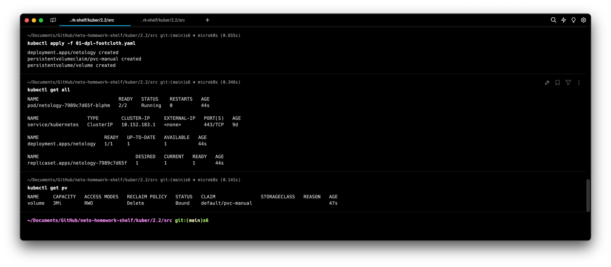

3. Продемонстрировать, что multitool может читать файл, в который busybox пишет каждые пять секунд в общей директории.
> Применяем Deployment; проверяем поды; подключаемся в интерактивный режим к контейнеру мультитула и читаем файл, так как если там есть записи, то и контейнер бизибокса настроен корректно.
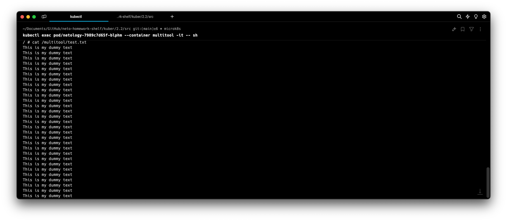

4. Удалить Deployment и PVC. Продемонстрировать, что после этого произошло с PV. Пояснить, почему.
> После удаления Deployment и PVC статус PV стал Failed. Связано с политикой Delete
> describe нам показывает ошибку `host_path deleter only supports /tmp/.+ but received provided /data/pv1`, то есть оно может удалять только /tmp
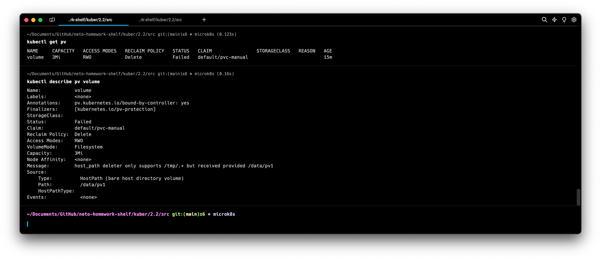

5. Продемонстрировать, что файл сохранился на локальном диске ноды. Удалить PV.  Продемонстрировать что произошло с файлом после удаления PV. Пояснить, почему.
> Зайдем на ноду и посмотрим что файл лежит[^1]
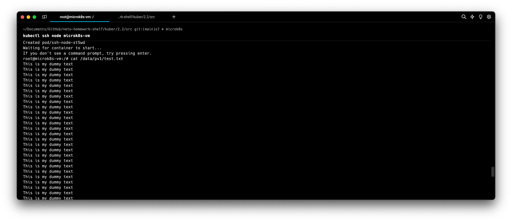
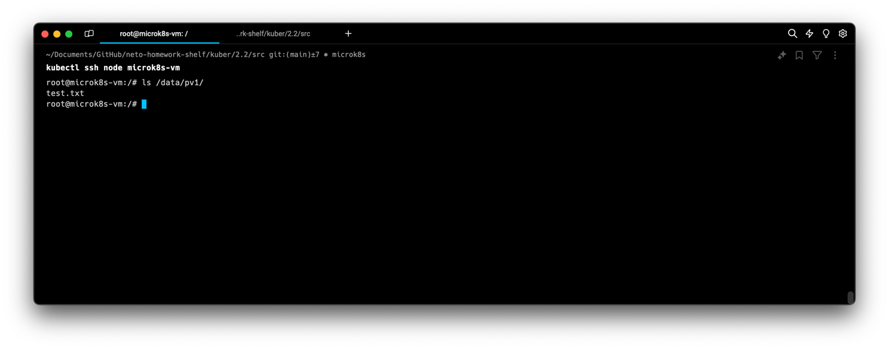
> Удалим PV
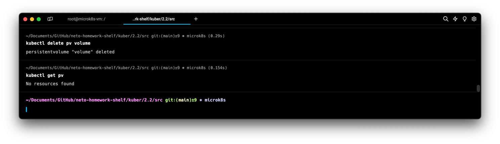
> Проверим файлик на ноде
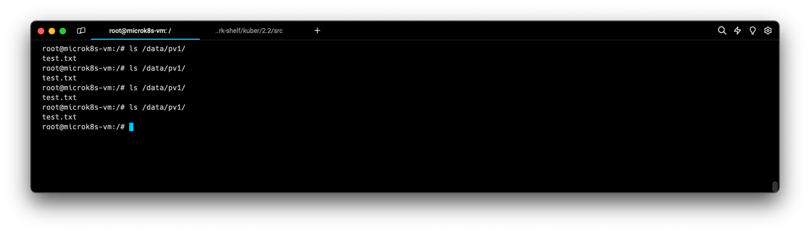
> Файл остался на надо, так как была ошибка удаления, не все драйверы поддерживают удаление

6. Предоставить манифесты, а также скриншоты или вывод необходимых команд. ✅

------

### Задание 2

**Что нужно сделать**

Создать Deployment приложения, которое может хранить файлы на NFS с динамическим созданием PV.

1. Включить и настроить NFS-сервер на MicroK8S.
> Включаем все необходимое
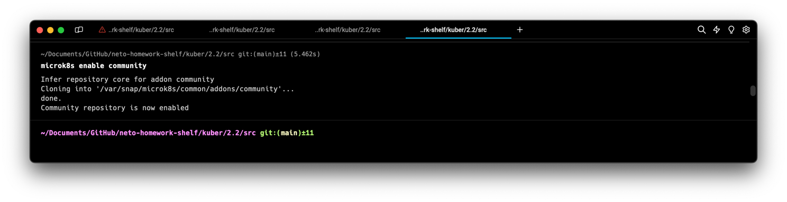
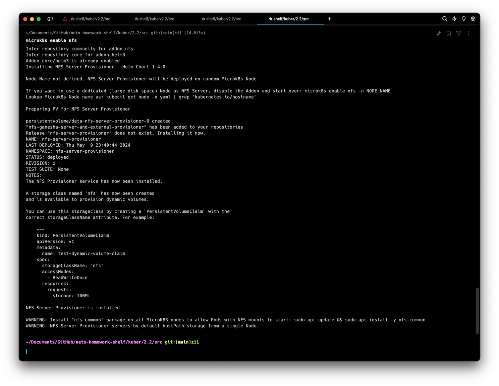
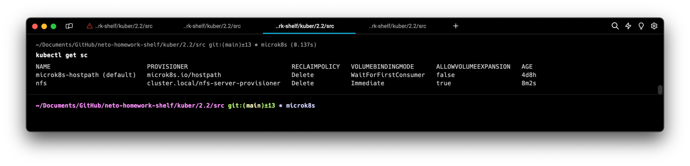
> Дополнительно на ноде запустим команду `sudo apt update && sudo apt install -y nfs-common` как рекомендуется
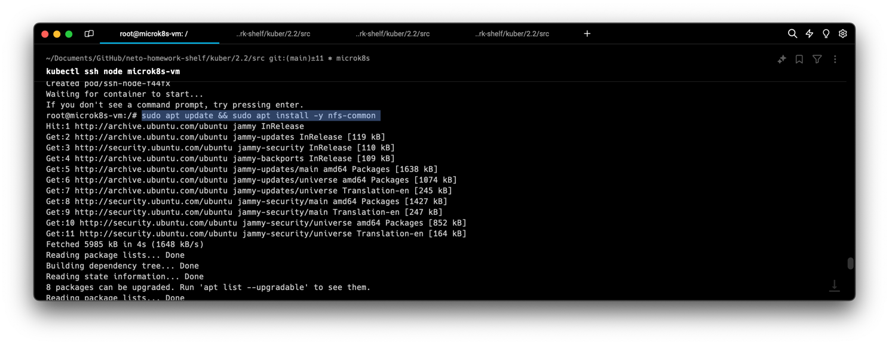
> У нас теперь есть SC `nfs` и PV `data-nfs-server-provisioner-0`
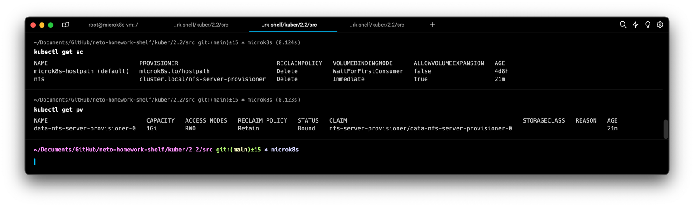
2. Создать Deployment приложения состоящего из multitool, и подключить к нему PV, созданный автоматически на сервере NFS.
> [Файл с Deployment и PVC](src%2F02-dpl-nfc.yaml)
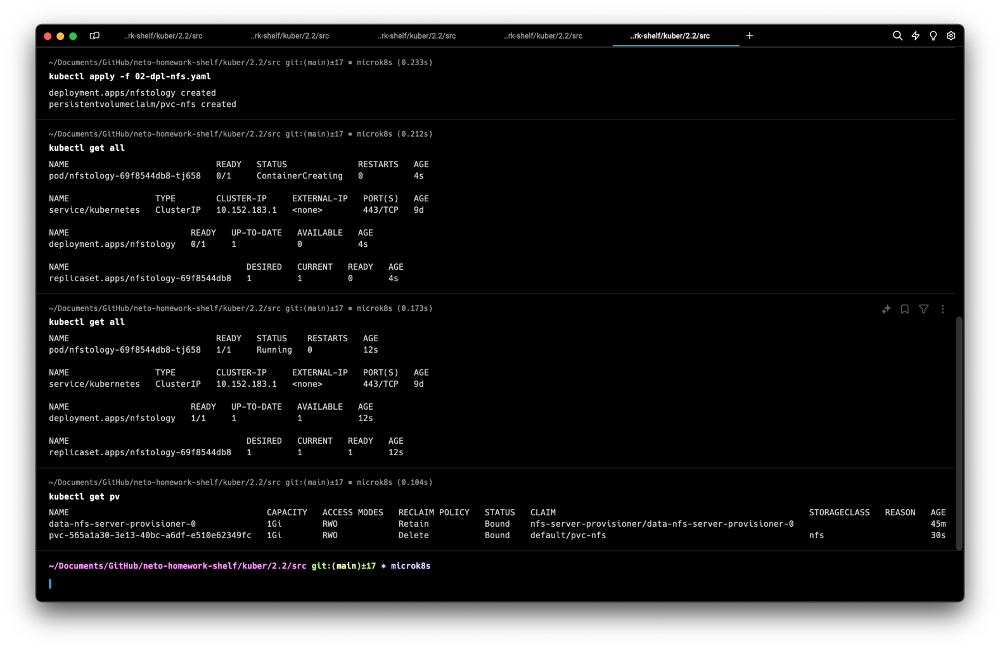
3. Продемонстрировать возможность чтения и записи файла изнутри пода.
> Подключаемся в интерактивном режиме и делаем простейшие операции
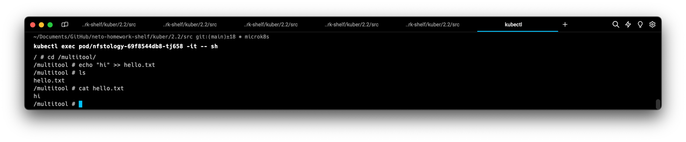
4. Предоставить манифесты, а также скриншоты или вывод необходимых команд. ✅

------

### Правила приёма работы

1. Домашняя работа оформляется в своём Git-репозитории в файле README.md. Выполненное задание пришлите ссылкой на .md-файл в вашем репозитории.
2. Файл README.md должен содержать скриншоты вывода необходимых команд `kubectl`, а также скриншоты результатов.
3. Репозиторий должен содержать тексты манифестов или ссылки на них в файле README.md.

[^1]: для простого похода на ноду использовался плагин https://github.com/luksa/kubectl-plugins
