# Домашняя работа к занятию «Конфигурация приложений»

### Цель задания

В тестовой среде Kubernetes необходимо создать конфигурацию и продемонстрировать работу приложения.

---

### Чеклист готовности к домашнему заданию

1. Установленное K8s-решение (например, MicroK8s).
2. Установленный локальный kubectl.
3. Редактор YAML-файлов с подключённым GitHub-репозиторием.

---

### Инструменты и дополнительные материалы, которые пригодятся для выполнения задания

1. [Описание](https://kubernetes.io/docs/concepts/configuration/secret/) Secret.
2. [Описание](https://kubernetes.io/docs/concepts/configuration/configmap/) ConfigMap.
3. [Описание](https://github.com/wbitt/Network-MultiTool) Multitool.

---

### Задание 1. Создать Deployment приложения и решить возникшую проблему с помощью ConfigMap. Добавить веб-страницу

1. Создать Deployment приложения, состоящего из контейнеров nginx и multitool.

> Допустим создали [Deployment](src%2F01-dpl-multinginx.yaml) с контейнерами без каких либо настроек:
>
> ```yaml
> ...
>       containers:
>         - name: nginx
>           image: nginx:1.14.2
>         - name: network-multitool
>           image: wbitt/network-multitool
> ...
> ```
>
> Получили под с ошибкой, где может стартовать только 1 контейнер
> 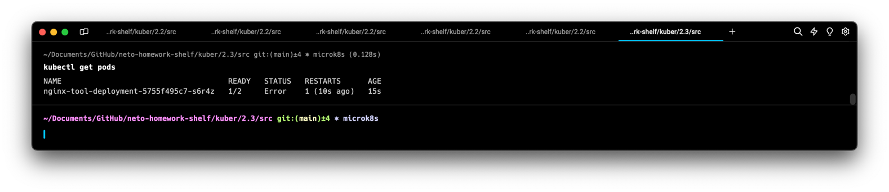
> Как видим из логов второй контейнер не стартует из-за невозможности забиндить 80 порт, так как он занят более быстрым на запуск контейнером
> 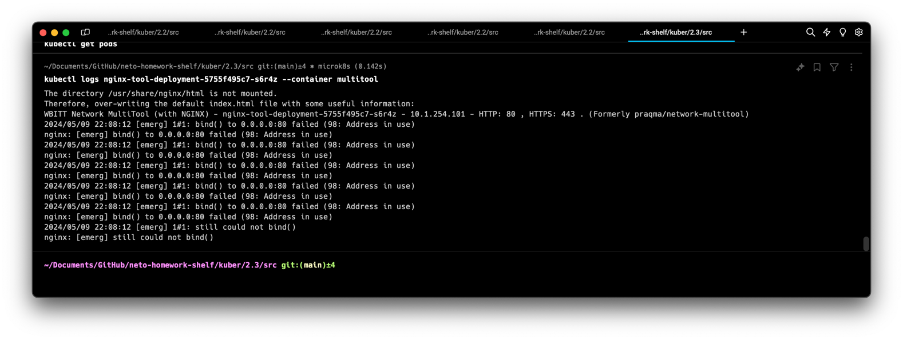

2. Решить возникшую проблему с помощью ConfigMap.

> Пишем простенький [ConfigMap](src%2F01-cm.yaml), добавляем в [Deployment](src%2F01-dpl-multinginx.yaml) env параметр

3. Продемонстрировать, что pod стартовал и оба контейнера работают.

> Стартануло и работает
> 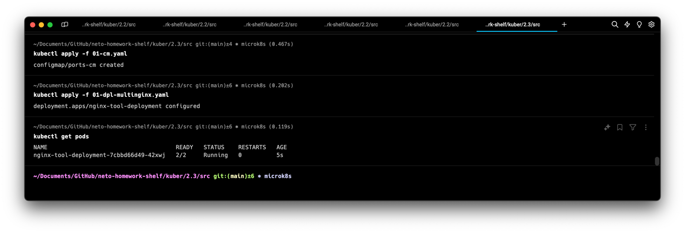

4. Сделать простую веб-страницу и подключить её к Nginx с помощью ConfigMap. Подключить Service и показать вывод curl или в браузере.

> Дописываем в наш [ConfigMap](src%2F01-cm.yaml) ключик `lorem` с позабытой "рыбой"
>
> Создаем [Service](src%2F01-svc.yaml)
> Проверяем что все развернулось
> 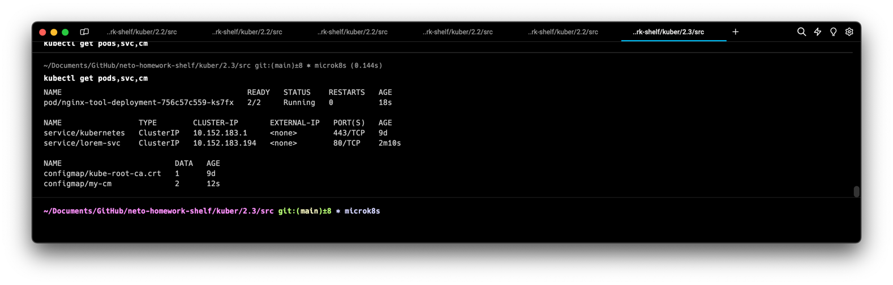
> Стартуем временный под для `curl` - `kubectl run my-curl-pod --image=curlimages/curl -it --rm -- sh`
> 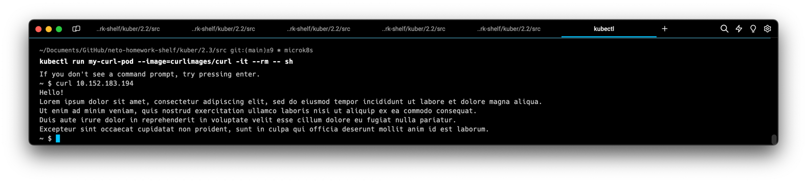
> Работает

5. Предоставить манифесты, а также скриншоты или вывод необходимых команд. ✅

---

### Задание 2. Создать приложение с вашей веб-страницей, доступной по HTTPS

1. Создать Deployment приложения, состоящего из Nginx.
> [02-https-dpl.yaml](src%2F02-https-dpl.yaml)
2. Создать собственную веб-страницу и подключить её как ConfigMap к приложению.
> [02-https-content-cm.yaml](src%2F02-https-content-cm.yaml)
>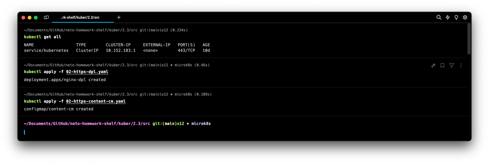
>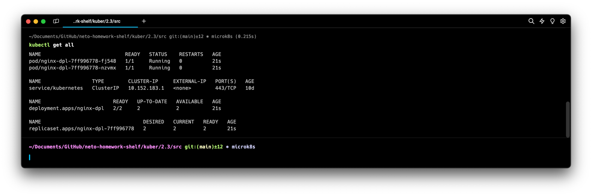
> Курланем один из подов, проверить ответ
> 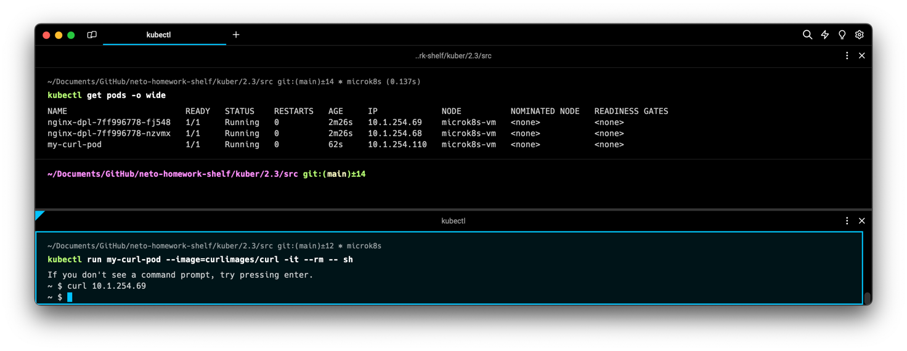
3. Выпустить самоподписной сертификат SSL. Создать Secret для использования сертификата.
> Предварительно пропишем себе в hosts домен `microk8s.local` с привязкой на внешний IP локального кластера[^1]
> Команда для выпуска `openssl req -x509 -nodes -days 365 -newkey rsa:2048 -keyout ./nginx-selfsigned.key -out ./nginx-selfsigned.crt -subj "/CN=microk8s.local"`
> 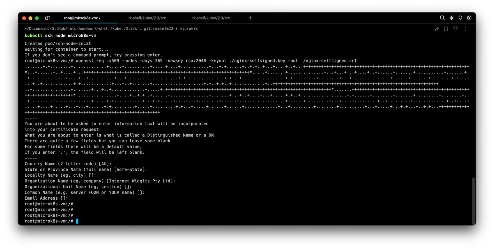
> 
> Энкодим содержимое этих файлов в base64 командами `cat nginx-selfsigned.key | base64` и `cat nginx-selfsigned.crt | base64`
> [02-secret.yaml](src%2F02-secret.yaml)[^2]
4. Создать Ingress и необходимый Service, подключить к нему SSL в вид. Продемонстрировать доступ к приложению по HTTPS.
> [02-ingress-srv.yaml](src%2F02-ingress-srv.yaml)
> 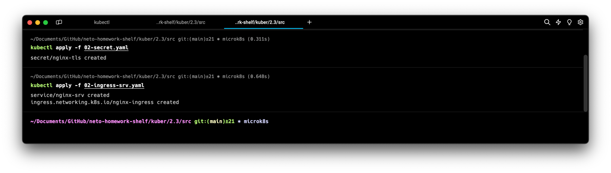
> 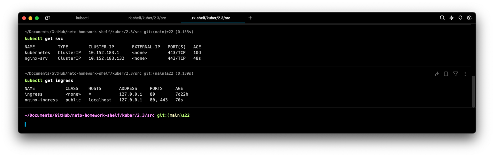
> Проверим
> 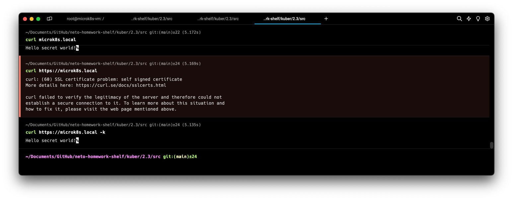
> 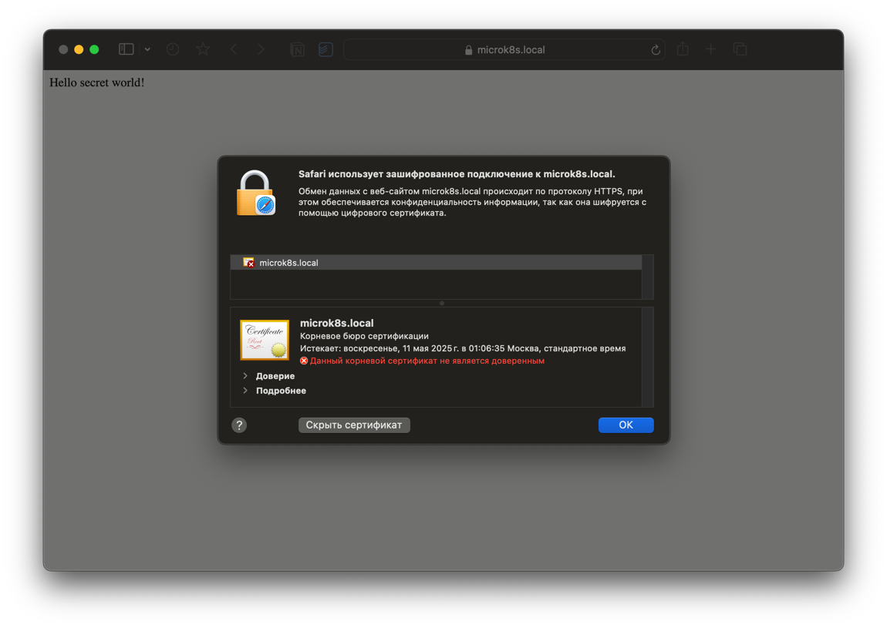
5. Предоставить манифесты, а также скриншоты или вывод необходимых команд. ✅

[^1]: спасибо MacOS, сделать теперь это не просто

[^2]: настоящие секреты публиковать конечно же не стоит

---

### Правила приёма работы

1. Домашняя работа оформляется в своём GitHub-репозитории в файле README.md. Выполненное домашнее задание пришлите ссылкой на .md-файл в вашем репозитории.
2. Файл README.md должен содержать скриншоты вывода необходимых команд `kubectl`, а также скриншоты результатов.
3. Репозиторий должен содержать тексты манифестов или ссылки на них в файле README.md.

---
