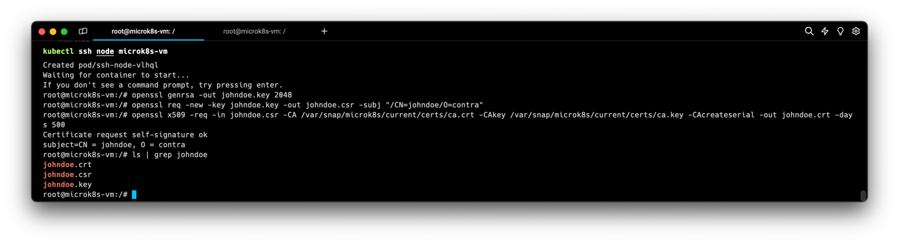
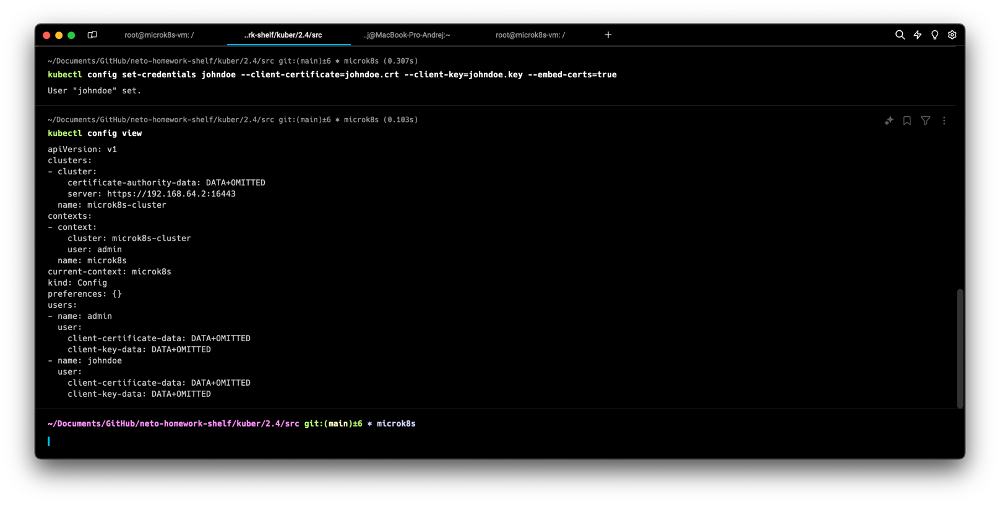
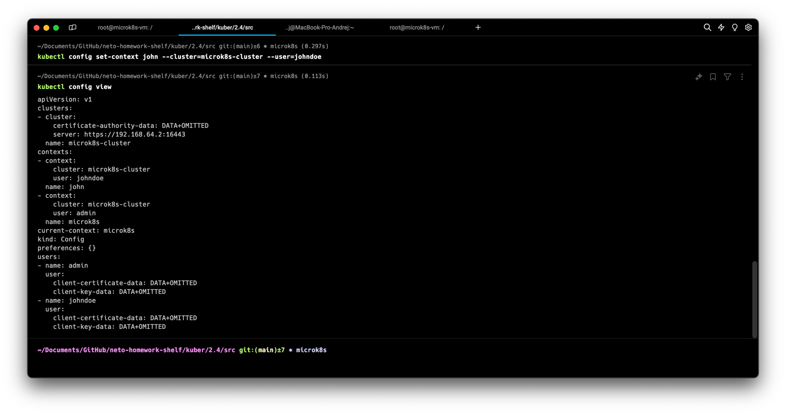
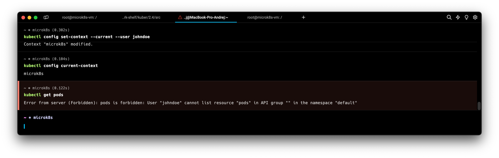
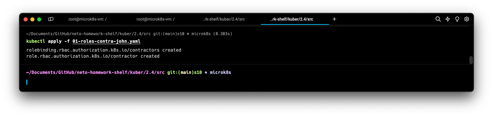
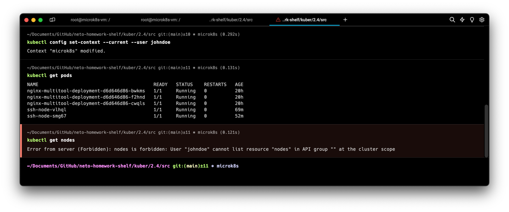
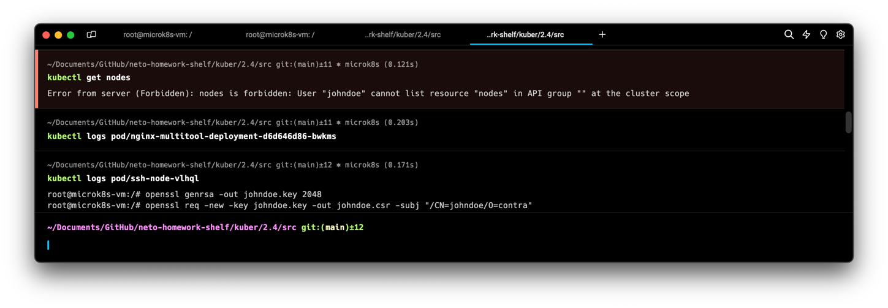
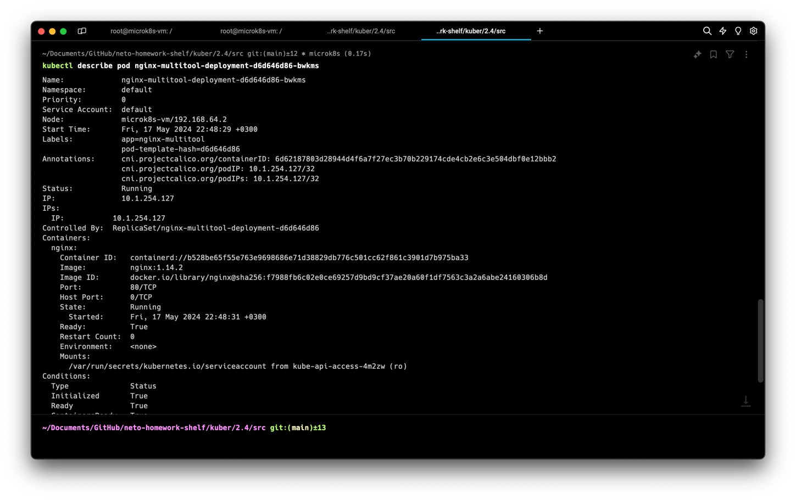

# Домашняя работа к занятию «Управление доступом»

### Цель задания

В тестовой среде Kubernetes нужно предоставить ограниченный доступ пользователю.

------

### Чеклист готовности к домашнему заданию

1. Установлено k8s-решение, например MicroK8S.
2. Установленный локальный kubectl.
3. Редактор YAML-файлов с подключённым github-репозиторием.

------

### Инструменты / дополнительные материалы, которые пригодятся для выполнения задания

1. [Описание](https://kubernetes.io/docs/reference/access-authn-authz/rbac/) RBAC.
2. [Пользователи и авторизация RBAC в Kubernetes](https://habr.com/ru/company/flant/blog/470503/).
3. [RBAC with Kubernetes in Minikube](https://medium.com/@HoussemDellai/rbac-with-kubernetes-in-minikube-4deed658ea7b).

------

### Задание 1. Создайте конфигурацию для подключения пользователя

1. Создайте и подпишите SSL-сертификат для подключения к кластеру.
> Подключаемся к кластеру с помощью плагина [kubectl ssh](https://github.com/luksa/kubectl-plugins/blob/master/README.md)
Генерируем закрытый ключ  `openssl genrsa -out johndoe.key 2048`
Запрос на подпись сертификата `openssl req -new -key johndoe.key -out johndoe.csr -subj "/CN=johndoe/O=contra"`
Подпишем CSR в Kubernetes CA на 500 дней `openssl x509 -req -in johndoe.csr -CA /var/snap/microk8s/current/certs/ca.crt -CAkey /var/snap/microk8s/current/certs/ca.key -CAcreateserial -out johndoe.crt -days 500`

Забираем любым удобным способом .key и .crt файлы

2. Настройте конфигурационный файл kubectl для подключения.
> Добавляем в конфиг `kubectl config set-credentials johndoe --client-certificate=johndoe.crt --client-key=johndoe.key --embed-certs=true`

Добавляем контекст `kubectl config set-context john --cluster=microk8s-cluster --user=johndoe`

Сменим пользователя, дабы посмотреть на ошибку доступа

3. Создайте роли и все необходимые настройки для пользователя.
>  [01-roles-contra-john.yaml](src%2F01-roles-contra-john.yaml)

4. Предусмотрите права пользователя. Пользователь может просматривать логи подов и их конфигурацию (`kubectl logs pod <pod_id>`, `kubectl describe pod <pod_id>`).
> Смотреть поды права есть, ноды - нет

Читать логи подов права есть (забавно, что можно подсмотреть все команды в логах из пода для подключения по ssh, надо учитывать это на будущее, благо под самоуничтожится)

Дискрабить поды права есть

5. Предоставьте манифесты и скриншоты и/или вывод необходимых команд. ✅

------

### Правила приёма работы

1. Домашняя работа оформляется в своём Git-репозитории в файле README.md. Выполненное домашнее задание пришлите ссылкой на .md-файл в вашем репозитории.
2. Файл README.md должен содержать скриншоты вывода необходимых команд `kubectl`, скриншоты результатов.
3. Репозиторий должен содержать тексты манифестов или ссылки на них в файле README.md.

------
