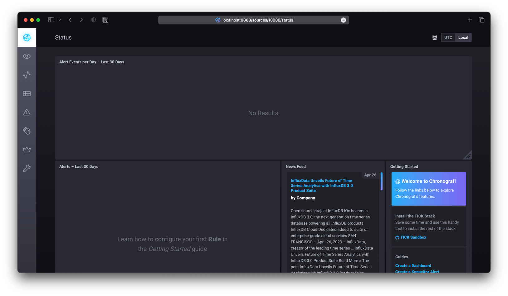
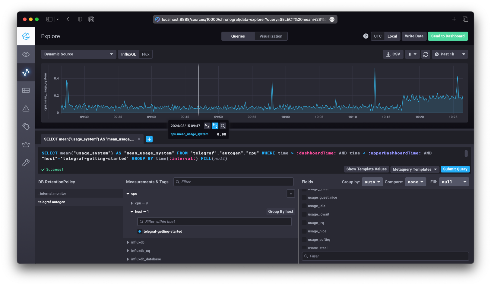
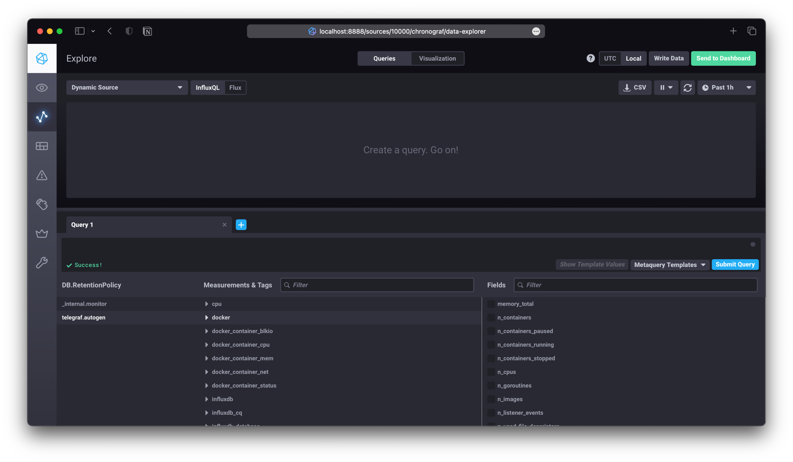

# Домашняя работа к занятию "13.Системы мониторинга"

## Обязательные задания

1. Вас пригласили настроить мониторинг на проект. На онбординге вам рассказали, что проект представляет из себя
   платформу для вычислений с выдачей текстовых отчетов, которые сохраняются на диск. Взаимодействие с платформой
   осуществляется по протоколу http. Также вам отметили, что вычисления загружают ЦПУ. Какой минимальный набор метрик вы
   выведите в мониторинг и почему?

   > - CPU load average - средние значения загрузки процессора за 1, 5 и 15 минут.
   > - Memory Info - информация об оперативной памяти: общее количество, использованное, свободное и используемое swap файлом.
   > - Disk info - информация о диске: свободное место, количество свободных индексных дескрипторов и производительность (Disk IOps).
   > - Состояние сетевых интерфейсов - отображение скорости работы, количества трафика и "отброшенных" пакетов.
   > - Статус сервиса web-сервера - информация о его состоянии (Up/Down).
   > - Коды ответов web-сервера - информирование клиентов о статусе выполнения запросов.
   > - Количество запросов к web-серверу в секунду - для своевременной реакции на проблемы в его работе и возможную DDoS-атаку.

---

2. Менеджер продукта посмотрев на ваши метрики сказал, что ему непонятно что такое RAM/inodes/CPUla. Также он сказал,
   что хочет понимать, насколько мы выполняем свои обязанности перед клиентами и какое качество обслуживания. Что вы
   можете ему предложить?

   > Перейти на понятные ему SLI/SLO/SLA: SLI - показатель, который измеряет, насколько хорошо выполняется цель обслуживания (SLO). 
   > Например, если в договоре (SLA) указано, что система должна работать без сбоев 99,95% времени, то SLO будет 99,95%. 
   > SLI будет показывать, сколько времени система на самом деле работает без сбоев. Если SLI выше, чем SLO, то все хорошо. 
   > Если SLI ниже, то нужно что-то делать, чтобы улучшить работу системы.

---

3. Вашей DevOps команде в этом году не выделили финансирование на построение системы сбора логов. Разработчики в свою
   очередь хотят видеть все ошибки, которые выдают их приложения. Какое решение вы можете предпринять в этой ситуации,
   чтобы разработчики получали ошибки приложения?

   > В данной ситуации можно использовать бесплатные инструменты для сбора и анализа логов, такие как ELK Stack (Elasticsearch, Logstash, Kibana) или Graylog. 
   > Эти инструменты позволяют собирать логи с различных источников и предоставляют удобный интерфейс для их анализа. 
   > Также можно использовать системы мониторинга, такие как Prometheus и Grafana, которые позволяют отслеживать состояние приложений и получать информацию об ошибках. 
   > Важно выбрать инструмент, который лучше всего подходит для нужд команды разработчиков и обеспечивает необходимую функциональность. 
   > При этом переложив большую часть расходов на самих разработчиков.

---

4. Вы, как опытный SRE, сделали мониторинг, куда вывели отображения выполнения SLA=99% по http кодам ответов.
   Вычисляете этот параметр по следующей формуле: summ_2xx_requests/summ_all_requests. Данный параметр не поднимается выше
   70%, но при этом в вашей системе нет кодов ответа 5xx и 4xx. Где у вас ошибка?

   > Ошибка может быть в том, что не учитываем коды ответов 3xx (перенаправление) и 1xx (промежуточные ответы). 
   > Эти коды ответов также могут влиять на общую производительность системы и не учитывать их может привести к неправильной оценке выполнения SLA.
   > Так же по моему мнению коды 3xx следует исключить из общего количества ответов, так как перенаправления не должны влиять на SLA

---

5. Опишите основные плюсы и минусы pull и push систем мониторинга.

   > Плюсы push-модели:
   > - упрощенная репликация данных в разные системы мониторинга или их резервные копии
   > - более гибкая настройка отправки пакетов данных с метриками
   > - UDP - это менее затратный способ передачи данных, из-за чего может возрасти производительность сбора метрик
   > 
   > Минусы push-модели:
   > - UDP - тяжелее контролировать подлинность данных
   > - более тяжелая в конфигурировании из-за гибкости
   > 
   > Плюсы pull-модели:
   > - легче контролировать подлинность данных
   > - можно настроить единый proxy server до всех агентов с TLS
   > - упрощённая отладка получения данных с агентов
   > 
   > Минусы pull-модели:
   > - меньшая производительность
   > - необходимость в открытых портах на объекте мониторинга
   > - нужен discovery - механизм обновления списка объектов мониторинга

---

6. Какие из ниже перечисленных систем относятся к push модели, а какие к pull? А может есть гибридные?

   - Prometheus - `основной pull, для push требуется pushgateway`
   - TICK - `push или pull в зависимости от возможностей input плагина`
   - Zabbix - `push или pull`
   - VictoriaMetrics - `основной pull через vmagent, но есть возможность push с использованием remote write`
   - Nagios - `основной pull и дополнительный push в зависимости от агента`

---

7. Склонируйте себе [репозиторий](https://github.com/influxdata/sandbox/tree/master) и запустите TICK-стэк,
   используя технологии docker и docker-compose.

   В виде решения на это упражнение приведите скриншот веб-интерфейса ПО chronograf (`http://localhost:8888`).

   P.S.: если при запуске некоторые контейнеры будут падать с ошибкой - проставьте им режим `Z`, например
`./data:/var/lib:Z`

   > 

---

8. Перейдите в веб-интерфейс Chronograf (http://localhost:8888) и откройте вкладку Data explorer.

    - Нажмите на кнопку Add a query
    - Изучите вывод интерфейса и выберите БД telegraf.autogen
    - В `measurments` выберите cpu->host->telegraf-getting-started, а в `fields` выберите usage_system. Внизу появится график утилизации cpu.
    - Вверху вы можете увидеть запрос, аналогичный SQL-синтаксису. Поэкспериментируйте с запросом, попробуйте изменить группировку и интервал наблюдений.

   Для выполнения задания приведите скриншот с отображением метрик утилизации cpu из веб-интерфейса.

   > 

---

9. Изучите список [telegraf inputs](https://github.com/influxdata/telegraf/tree/master/plugins/inputs).
   Добавьте в конфигурацию telegraf следующий плагин - [docker](https://github.com/influxdata/telegraf/tree/master/plugins/inputs/docker):
   ```
   [[inputs.docker]]
     endpoint = "unix:///var/run/docker.sock"
   ```

   Дополнительно вам может потребоваться донастройка контейнера telegraf в `docker-compose.yml` дополнительного volume и
режима privileged:
   ```
     telegraf:
       image: telegraf:1.4.0
       privileged: true
       volumes:
         - ./etc/telegraf.conf:/etc/telegraf/telegraf.conf:Z
         - /var/run/docker.sock:/var/run/docker.sock:Z
       links:
         - influxdb
       ports:
         - "8092:8092/udp"
         - "8094:8094"
         - "8125:8125/udp"
   ```
   
   После настройке перезапустите telegraf, обновите веб интерфейс и приведите скриншотом список `measurments` в
   веб-интерфейсе базы telegraf.autogen. Там должны появиться метрики, связанные с docker.
   
   Факультативно можете изучить какие метрики собирает telegraf после выполнения данного задания.

   > 
   > Была проблема с доступом к `/var/run/docker.sock`
   > 
   > Решил добавлением:
   > ```yaml
   > services:
   >   telegraf:
   >     ...
   >     entrypoint: /bin/bash -c "chmod 666 /var/run/docker.sock && /entrypoint.sh telegraf"
   >     ...
   > ```
